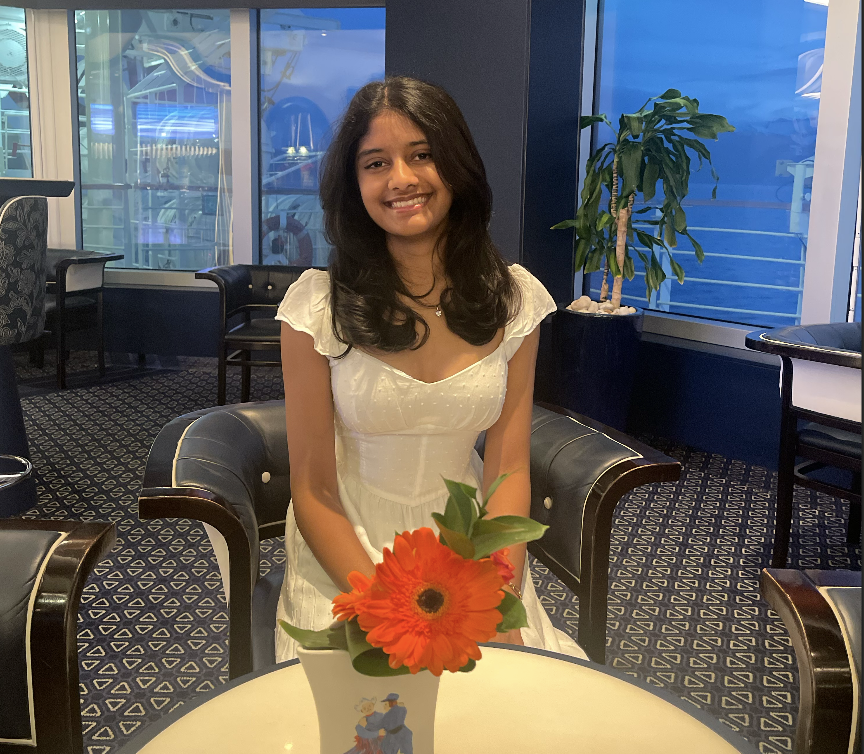
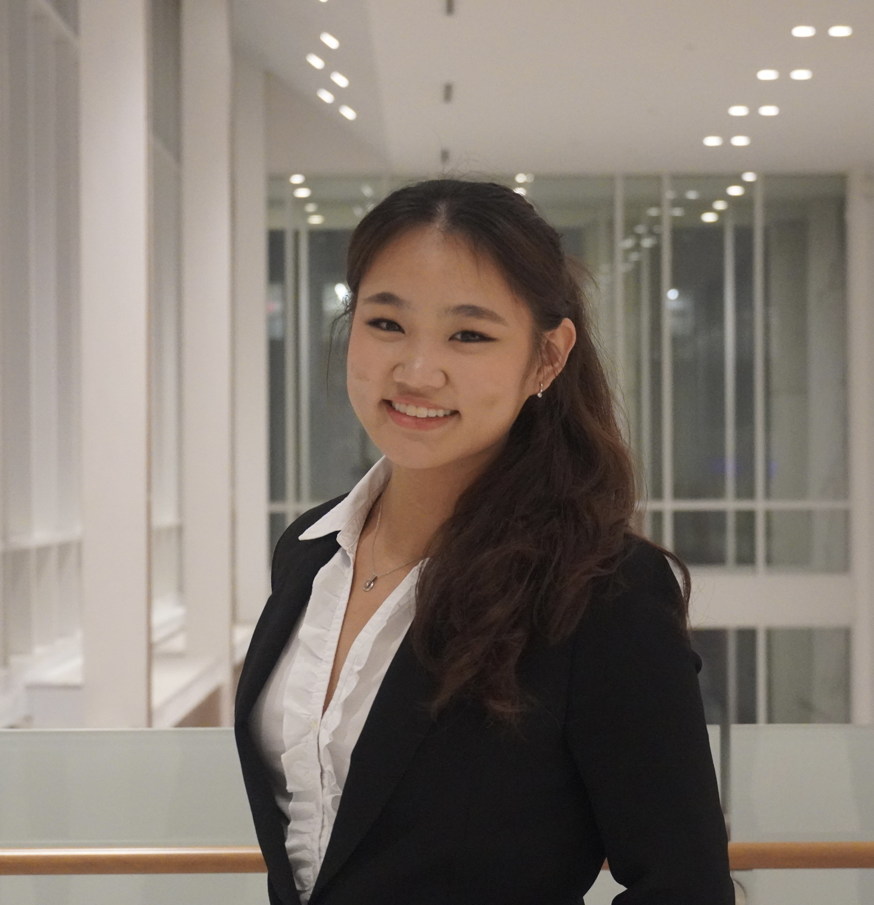

# 🌳 Sustainable Saratoga Tree Tracker

This repository contains the source code for the Sustainable Saratoga Tree Tracker, a mobile-optimized web application built for the organization's urban forestry committee. Sustainable Saratoga is a grassroots community organization in Saratoga Springs, New York focused on local sustainability and environmental advocacy. The urban forestry committee plants roughly 40 trees each April with the help of about 150 volunteers.

The Tree Tracker replaces Fulcrum, the committee's current (and no longer maintained) tree tracking tool, with a single purpose-built application that consolidates all historical and current-year data and supports the full annual planting workflow.

## Features

- **Tree records:** species, cultivar, condition, measurements, pruning history, planting date, photos, homeowner contact info, location type (public vs. private), and assignment to committee members
- **Planting workflow:** track requests through an approval pipeline (requested → approved → planted / not planted), including city approval and utility clearance
- **Mapping:** pin exact planting locations and filter the map by status, year, species, and activity type
- **Field use:** add and update records from a mobile device (offline support is being explored)
- **Filtering:** filter by any data field, with saved filter presets and default views based on volunteer role (planting vs. pruning)
- **Export:** export tree lists and maps for city reporting and pre-event planning
- **Admin tools:** configure fields, manage pick lists, and manage user accounts
- **Crew sheets (nice-to-have):** auto-generate printable per-site planting sheets

## Tech Stack

- **Frontend:** [React](https://react.dev/) + [Vite](https://vitejs.dev/)
- **Routing:** [TanStack Router](https://tanstack.com/router)
- **Language:** [TypeScript](https://www.typescriptlang.org/)
- **Styling:** [Tailwind CSS](https://tailwindcss.com/)
- **API:** [tRPC](https://trpc.io/) on [Express](https://expressjs.com/)
- **Schema Validation:** [ArkType](https://arktype.io/)
- **BaaS / Hosting:** [Firebase](https://firebase.google.com/) (Cloud Functions)

## Directory Structure

```
sustainable-saratoga/
├── packages/
│   ├── frontend/   # React + Vite web application (TanStack Router, Tailwind CSS)
│   ├── backend/    # tRPC API on Express, deployed as Firebase Cloud Functions
│   └── common/     # Shared TypeScript types and ArkType schemas
├── firebase.json   # Firebase project and emulator configuration
└── package.json    # Root package.json with workspace-level scripts
```

## Running Locally

> [!IMPORTANT]
> Prerequisites: [Node.js](https://nodejs.org/) and [pnpm](https://pnpm.io/) installed, plus the [Firebase CLI](https://firebase.google.com/docs/cli) (`pnpm i -g firebase-tools`).

1. Install dependencies:

   ```sh
   pnpm install
   ```

2. Build the shared `common` package (required before first run):

   ```sh
   pnpm --filter common run build
   ```

3. Start the development environment:

   ```sh
   pnpm dev
   ```

   This launches the Firebase emulators and the frontend dev server. See `firebase.json` for the emulator ports.

## Meet the Team

> [!NOTE]
> **Onboarding task:** add yourself to this section. After creating a (`[name]-readme`) branch, place your photo in `assets/team/` (e.g. `firstname-lastname.jpg`), copy an existing entry for your role, and update the name, image path, and optional GitHub/LinkedIn link. Then add yourself to the Points of Contact table if you're a lead. Lastly, create a PR with your changes! :)

### 🧭 Product Managers

<table align="center">
  <tr>
    <td align="center" width="160">
      <a href="https://www.linkedin.com/in/arik-hasan/" target="_blank" rel="noreferrer noopener">
        <br/>
        <b>Arik Hasan</b><br/>
        
      </a>
    </td>
    <td align="center" width="160">
      <a href="https://www.linkedin.com/in/anunithaa/" target="_blank" rel="noreferrer noopener">
        <br/>
        <b>Anunithaa Rajakumaresan</b><br/>
        
      </a>
    </td>
  </tr>
</table>

### 🛠 Tech Leads

<table align="center">
  <tr>
    <td align="center" width="160">
      <a href="https://www.linkedin.com/in/orimarx/" target="_blank" rel="noreferrer noopener">
        <br/>
        <b>Ori Marx</b><br/>
        
      </a>
    </td>
    <td align="center" width="160">
      <a href="https://github.com/om-arya" target="_blank" rel="noreferrer noopener">
        <br/>
        <b>Om Arya</b><br/>
        
      </a>
    </td>
  </tr>
</table>

### 🎨 Designers

<table align="center">
  <tr>
    <td align="center" width="160">
      <a href="https://www.linkedin.com/in/christine-t-niu" target="_blank" rel="noreferrer noopener">
        <br/>
        <b>Christine Niu</b><br/>
        
      </a>
    </td>
    <td align="center" width="160">
      <a href="https://www.linkedin.com/in/pari-gill/" target="_blank" rel="noreferrer noopener">
        <br/>
        <b>Pari Gill</b><br/>
        
      </a>
    </td>
  </tr>
</table>

### 💻 Engineers

<table align="center">
  <tr>
    <td align="center" width="160">
      <br/>
      <b>Shakira Ali</b><br/>
      
    </td>
    <td align="center" width="160">
      <a href="https://www.linkedin.com/in/victoria-xiao-449844270/" target="_blank" rel="noreferrer noopener">
        <br/>
        <b>Victoria Xiao</b><br/>
        
      </a>
    </td>
    <td align="center" width="160">
      <a href="https://www.linkedin.com/in/dennis-huynh-08138336a" target="_blank" rel="noreferrer noopener">
        <br/>
        <b>Dennis Huynh</b><br/>
        
      </a>
    </td>
  </tr>
  <tr>
    <td align="center" width="160">
      <br/>
      <b>Shreyas Thirumale</b><br/>
      
    </td>
    <td align="center" width="160">
      <br/>
      <b>Engineer Name</b><br/>
      
    </td>
    <td align="center" width="160">
      <br/>
      <b>Engineer Name</b><br/>
      
    </td>
    <td align="center" width="160">
    <a href="https://www.linkedin.com/in/charu-mehta1/" target="_blank" rel="noreferrer noopener">
      <br/>
      <b>Charu Mehta</b><br/>
      
      </a>
    </td>
  </tr>
</table>

---

## Points of Contact

| Name     | Role      | Email                 |
| -------- | --------- | --------------------- |
| Ori Marx | Tech Lead | orimarx@gmail.com     |
| Om Arya  | Tech Lead | om.arya0577@gmail.com |
